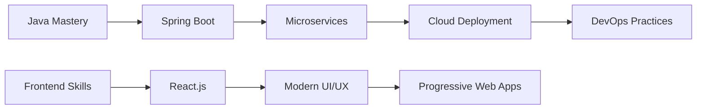

# Hi there! 👋 I'm Abdul Hazeez

<div align="center">
  
[](https://git.io/typing-svg)

</div>

---

## 🚀 About Me

```java
public class AbdulHazeez {
    private String name = "Abdul Hazeez";
    private String role = "Software Developer";
    private String location = "Pakistan";
    private String[] languages = {"Java", "HTML5", "CSS3", "JavaScript"};
    private String currentFocus = "Full Stack Development";
    private boolean openToWork = true;
    
    public String getAmbition() {
        return "Transforming ideas into elegant code solutions";
    }
}
```

- 🔭 Currently working on **Full Stack Web Applications**
- 🌱 Learning **Spring Boot, React, and Cloud Technologies**
- 👯 Looking to collaborate on **Open Source Projects**
- 💬 Ask me about **Java Development, Web Technologies**
- ⚡ Fun fact: **I debug with coffee and solve problems with persistence!**

---

## 🛠️ Tech Arsenal

### Languages & Core Technologies
<p align="center">
  
</p>

### Frameworks & Libraries
<p align="center">
  
</p>

### Databases & Tools
<p align="center">
  
</p>

### Cloud & DevOps (Learning)
<p align="center">
  
</p>

---

## 📈 GitHub Analytics

<div align="center">
  
  
</div>

<div align="center">
  
</div>

<div align="center">
  
</div>

---

## 🏆 GitHub Achievements

<div align="center">
  
</div>

---

## 🎯 Current Learning Path



---

## 🌟 Featured Projects

<div align="center">

| Project | Description | Technologies | Status |
|---------|-------------|--------------|--------|
| 🏪 **E-Commerce Platform** | Full-featured online shopping platform | Java, Spring Boot, MySQL | 🚀 In Progress |
| 📱 **Task Management App** | Collaborative task tracking system | HTML5, CSS3, JavaScript | ✅ Completed |
| 🎮 **Java Game Engine** | 2D game development framework | Java, Swing | 🔄 Ongoing |

</div>

---

## 📊 Weekly Development Breakdown

```text
Java         12 hrs 30 mins  ████████████████████  45.2%
HTML/CSS     8 hrs 15 mins   ██████████████        29.8%
JavaScript   4 hrs 45 mins   █████████             17.1%
SQL          2 hrs 10 mins   ████                   7.9%
```

---

## 🤝 Let's Connect & Collaborate

<div align="center">
  
[](https://linkedin.com/in/abdul-hazeez-9554a727a)
[](https://github.com/AHazeez)
[](mailto:your.email@example.com)
[](#)

</div>

---

## 💡 Quick Facts

<div align="center">

🎓 **Continuous Learner** | 💻 **Problem Solver** | 🚀 **Innovation Enthusiast**

*"Code is like humor. When you have to explain it, it's bad."* – Cory House

</div>

---

## 🎮 Fun Zone

<div align="center">
  
### 🐍 Watch the Snake eat my contributions!


### 🎵 Currently Coding To:
[](https://open.spotify.com/user/yourspotifyusername)

</div>

---

<div align="center">

### 📈 Profile Views


### ⭐ Show some love by starring my repositories!

**Thanks for visiting! Let's build something amazing together! 🚀**

</div>

---

<div align="center">
  
</div>
